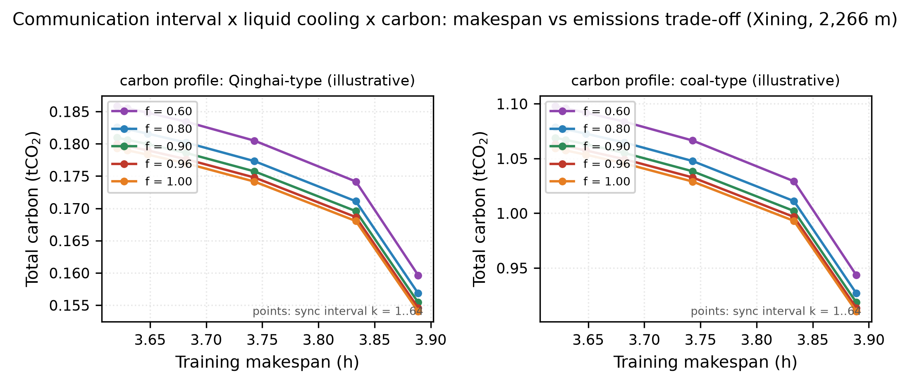
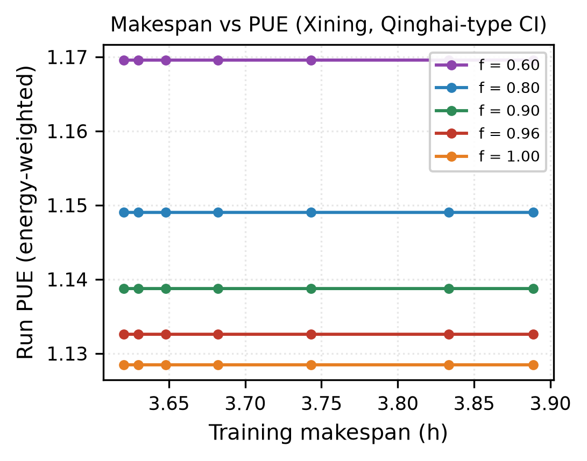
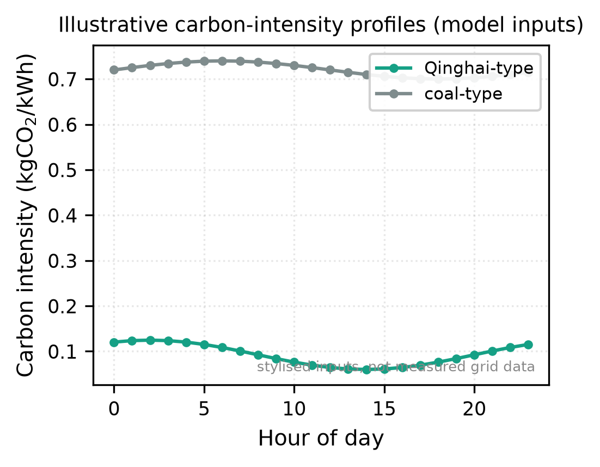
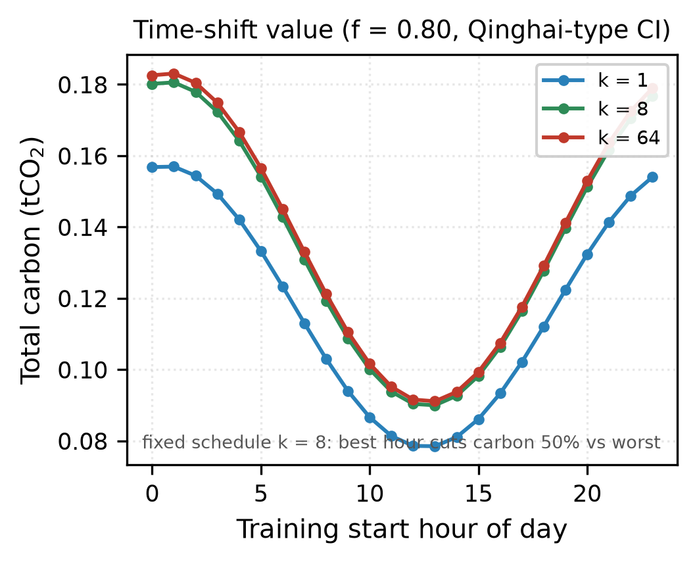
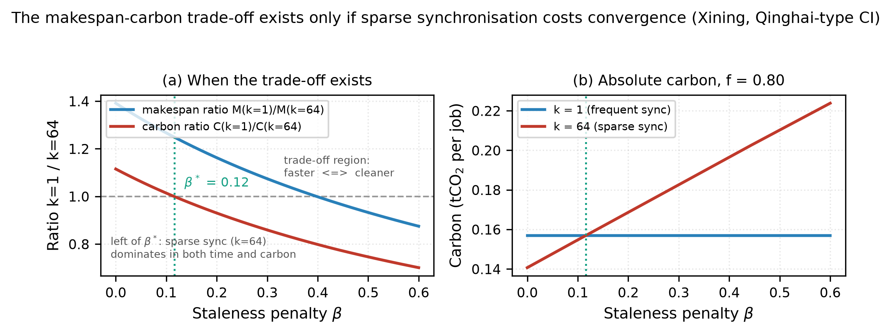

# Communication scheduling is an energy decision: makespan-carbon trade-offs for distributed AI training in a high-altitude data centre

**Xian Cai**

School of Intelligent Science and Engineering, Qinghai Minzu University, Xining, Qinghai 810007, China
caixian901@gmail.com · ORCID [0009-0007-5083-7078](https://orcid.org/0009-0007-5083-7078)

**Preprint** · 2026 · Companion to [doi:10.5281/zenodo.22743562](https://doi.org/10.5281/zenodo.22743562)
Code, data and figures: [github.com/caixian901-design/energy-aware-comm-scheduling](https://github.com/caixian901-design/energy-aware-comm-scheduling)

---

## Abstract

Distributed AI training is scheduled by its communication: how often the workers synchronise gradients is the scheduler's most direct control over makespan, and it is almost always tuned for time alone. This paper asks what that tuning costs in energy and carbon. A 512-accelerator data-parallel training pod (compute phase plus all-reduce communication phase) is coupled to a weather-driven facility model at a 2 266 m plateau site and to two illustrative hourly grid carbon-intensity profiles. A three-way sweep over the synchronisation interval k, the liquid-cooling fraction f and the carbon profile yields three results. First, the schedule is a genuine energy decision: at f = 0.80 the fastest schedule (k = 64) is 7.4 % faster than the most frequent (k = 1) but emits 14.1 % more carbon, while the mean PUE of the two is **identical to five decimal places (1.14901)** — the facility metric is blind to the very decision that moves carbon by 16 %. Second, the other levers are smaller or external: the whole liquid-cooling range f = 0.60 to 1.00 changes carbon by 3.5 %, whereas the grid scenario changes it by 5.9x and the training start hour alone by 50 % for a fixed schedule. Third, the trade-off is conditional: it exists only when sparse synchronisation costs convergence, and the crossover staleness penalty is derived analytically as beta* = B/(A + B/k), which is 0.114 for the parameters used here (numerically 0.116). Communication scheduling should therefore be treated as an energy and carbon objective, reported as energy-to-solution and carbon per delivered step alongside PUE. All results are model-derived and reproduced by openly available code with no digitised data.

**Keywords:** data centre energy efficiency · PUE · GPU training load · distributed training · all-reduce · communication scheduling · carbon-aware computing · carbon intensity · liquid cooling · high altitude · Qinghai-Tibetan Plateau · East Data West Computing

---

## 1. Introduction

### 1.1 Motivation

Distributed training of large models is the dominant workload of the AI computing hubs that China's "East Data, West Computing" (东数西算) programme has located in the cold, high-renewable western provinces [1], [2]. Qinghai Province is one of the principal beneficiaries: the Haidong region, at 2 200 m nominal elevation and with an annual mean temperature near 6 °C, combines the cheapest cooling climate in the province with the lowest air-pressure penalty of its viable sites [6].

These hubs are governed largely on Power Usage Effectiveness (PUE), the ratio of total facility power to IT power [3]-[5]. PUE is a property of the *plant*: the cooling and distribution overhead that accompanies each watt of IT load. It says nothing about what the IT load is doing, and in particular nothing about the workload's duty cycle — the fraction of wall-clock time the accelerators actually spend computing.

Large-model training is not a steady load. Each training step alternates between a compute phase, in which tensor cores are saturated, and a communication phase, in which the workers block on a collective (typically an all-reduce) while the accelerators idle at reduced power. The frequency of these collectives — the synchronisation interval k — is a scheduler's most direct control over how long a job takes. It is also, this paper shows, an energy and carbon control, and one that PUE cannot see.

### 1.2 Research gap

Three literatures meet here but do not intersect:

1. **PUE modelling and data-centre cooling** treats the IT load as an exogenous, often constant, input [3]-[5]. The companion preprint [6] follows this convention, coupling altitude to air-side cooling capacity and reporting PUE as a function of the liquid-cooling fraction.
2. **Distributed training systems** analyses communication overhead, synchronisation schemes and throughput [7]-[11], but in time-to-accuracy terms, without a facility or grid model. Recent work on communication scheduling for distributed deep learning [7] and on load balancing in the lossless fabrics that carry training traffic [8] is squarely about time and network utilisation.
3. **Carbon-aware computing** schedules jobs against a grid carbon-intensity signal [12]-[14], typically assuming a fixed job power profile and a fixed cooling plant.

To our knowledge no study quantifies the energy and carbon side of the *communication-frequency* decision: how the same job's makespan, facility energy and emissions move when k is turned, at fixed parallelism, with the facility and the grid modelled explicitly. That is the question this paper answers.

### 1.3 Contributions

1. **A coupling.** A compute/communication-phase GPU training-load model with an explicit synchronisation interval k is coupled to a weather-driven PUE model at a plateau site and to hourly grid carbon intensity, giving makespan, PUE, energy and carbon as joint outputs of one schedule.
2. **A quantified trade-off.** At fixed parallelism the synchronisation interval is a genuine energy lever: the fastest schedule is not the cleanest (7.4 % faster, 14.1 % dirtier), and the mean PUE of both is identical to five decimal places. PUE is confirmed to be invariant to the schedule while the schedule moves carbon by 16 %.
3. **A condition for the trade-off.** The makespan-carbon tension exists only if sparse synchronisation costs convergence. The crossover staleness penalty is derived in closed form, beta* = B/(A + B/k) = 0.114, and verified numerically.
4. **A lever ranking for operators.** Liquid fraction (3.5 %), grid choice (5.9x) and start-hour scheduling (50 %) are quantified on one consistent model, giving an explicit ranking of where carbon attention should go.

### 1.4 Paper organisation

§2 defines the system model and the case study. §3 states the solution method. §4 presents the results. §5 discusses the implications and the limitations. §6 concludes.

---

## 2. System model

### 2.1 Facility layer: weather-driven PUE

The facility model is that of the companion preprint [6], reused without modification so that the two studies cannot drift apart. At ambient temperature T and air-density ratio rho_r (0.7999 at 2 266 m), the air-side and liquid-side coefficients of performance are

$$\mathrm{COP}_a(T) = \mathrm{COP}_{a,fc}\,\rho_r^{\gamma} \quad (T \leq T_{a,fc}),$$

$$\mathrm{COP}_l(T) = \mathrm{COP}_{l,fc}\,\rho_r^{0.3} \quad (T \leq T_{l,fc}),$$

with chiller fallback above the free-cooling thresholds, and the hourly PUE for a liquid-cooling fraction f is

$$\mathrm{PUE}(f,T) = 1 + \frac{1-f}{\mathrm{COP}_a(T)} + \frac{f}{\mathrm{COP}_l(T)} + \lambda_d + \lambda_o .$$

The constants (COP_{a,fc} = 10, COP_{l,fc} = 20, T_{a,fc} = 20 °C, T_{l,fc} = 32 °C, lambda_d = 0.055, lambda_o = 0.02, gamma = 2.0) are exactly those of [6]. Weather is the measured TMYx 2011-2025 typical meteorological year file for Xining (2 266 m, annual mean 6.12 °C); Beijing (35 m) and Shanghai (3 m) are evaluated in the sweep for reference.

### 2.2 Workload layer: compute phase, communication phase, synchronisation interval

A data-parallel training job of N compute steps runs on n_gpu accelerators and synchronises every k steps, issuing C = N_eff/k all-reduce collectives. Each step has a compute phase of wall time t_c at power P_c per accelerator, and each collective exposes t_m of wall time at power P_m (the accelerator idles at reduced power while the fabric carries the gradient). The makespan is

$$T(k) = N_{\mathrm{eff}}(k)\left(t_c + \frac{t_m}{k}\right),$$

and the per-accelerator energy separates exactly into a useful term and a communication overhead:

$$E_{\mathrm{gpu}}(k) = N_{\mathrm{eff}}(k)\left(t_c P_c + \frac{t_m}{k} P_m\right).$$

**Staleness / convergence model.** Synchronising less often makes gradients staler, and a run that converges in N steps at k = 1 needs more steps at large k. We model this with a single penalty parameter beta:

$$N_{\mathrm{eff}}(k) = N\left(1 + \beta\left(1 - \frac{1}{k}\right)\right).$$

beta = 0 is the no-staleness baseline in which sparse synchronisation is free; beta > 0 makes it costly. The default used in the main sweep is beta = 0.30 (literature-typical for data-parallel training without loss scaling); §4.4 treats beta as the free parameter it is.

### 2.3 Carbon accounting

The job runs T hours from a start hour; a partial final hour is charged pro rata. Facility power in hour h is the mean IT power times the hourly PUE, and grid energy and carbon are

$$E_{\mathrm{fac}} = \sum_h \bar{P}_{\mathrm{IT}}\,\mathrm{PUE}(f,T_h)\,\Delta t_h, \qquad
C = \sum_h \bar{P}_{\mathrm{IT}}\,\mathrm{PUE}(f,T_h)\,\mathrm{CI}(h)\,\Delta t_h,$$

with CI(h) the hourly grid carbon intensity. Because CI(h) varies, the same energy at a different time is a different carbon — the mechanism that makes scheduling an energy decision.

### 2.4 Case study and parameterisation

The case study is a 512-accelerator training pod (one mid-size job on a hub-scale cluster), the density-forced liquid fraction f = 0.80 of [6], and the Qinghai-type grid as the primary scenario, with a coal-heavy counterfactual. Table 1 lists the parameters.

**Table 1. Cluster, job and grid parameters.**

| Parameter | Value | Rationale |
|---|---|---|
| Accelerators n_gpu | 512 | one training pod |
| Compute-phase power P_c per accelerator | 700 W | accelerator, compute |
| Collective-phase power P_m per accelerator | 200 W | accelerator idle + network |
| Step compute time t_c | 1.0 s | reference step |
| All-reduce time t_m | 0.4 s | bandwidth-bound collective |
| Baseline iterations N | 10 000 | one large run |
| Staleness penalty beta (default) | 0.30 | §2.2; sensitivity in §4.4 |
| Liquid-cooling fraction f | 0.60-1.00 | sweep |
| Synchronisation interval k | 1-64 | powers of two |
| Carbon profiles | Qinghai-type, coal-type | illustrative, Table 2 |

**Table 2. Illustrative grid carbon-intensity profiles (model inputs, not metered data).**

| Profile | Range (kgCO2e/kWh) | Effective mean over a run |
|---|---|---|
| Qinghai-type (high renewable) | 0.065-0.135, daily swing | 123 g/kWh |
| Coal-type (heavy fossil) | 0.70-0.74, nearly flat | 727 g/kWh |

The Qinghai-type profile is intended to reflect a grid with a large hydro, solar and wind share: low and strongly diurnal, with a midday solar trough. Both profiles are cosine models, deliberately simple; §5.2 states what a metered series would add.

---

## 3. Solution method

The model is evaluated on the grid k ∈ {1, 2, 4, 8, 16, 32, 64}, f ∈ {0.60, 0.80, 0.90, 0.96, 1.00}, two carbon profiles, and three sites — 210 evaluated points, plus a 24-point start-hour sweep per (f, k, profile) and a 601-point beta sweep for §4.4. Everything is closed form; no solver is required. Metrics per run: makespan T(k), IT energy, facility energy, energy-weighted run PUE, total carbon and effective carbon intensity (carbon / facility energy). The hourly PUE is pre-averaged over all 365 days into a 24-point daily profile, so the run's facility energy depends only on the hours it occupies.

---

## 4. Results

All results are for Xining unless stated. The Qinghai-type profile is the primary carbon scenario.

### 4.1 The headline trade-off

Table 3 shows the full sweep of the synchronisation interval at the design liquid fraction f = 0.80.

**Table 3. Synchronisation interval k at f = 0.80, Xining, Qinghai-type grid.**

| k | Makespan (h) | IT energy (kWh) | Facility energy (kWh) | Mean PUE | Carbon (kgCO2) |
|---|---|---|---|---|---|
| 1 | 3.8889 | 1109.33 | 1274.64 | 1.14901 | 156.80 |
| 2 | 3.8333 | 1210.31 | 1390.66 | 1.14901 | 171.10 |
| 4 | 3.7431 | 1254.40 | 1441.32 | 1.14901 | 177.30 |
| 8 | 3.6823 | 1274.84 | 1464.81 | 1.14901 | 180.20 |
| 16 | 3.6480 | 1284.67 | 1476.10 | 1.14901 | 181.60 |
| 32 | 3.6299 | 1289.48 | 1481.63 | 1.14901 | 182.20 |
| 64 | 3.6206 | 1291.86 | 1484.36 | 1.14901 | 182.60 |

Two columns carry the result. **The mean PUE column is constant at 1.14901 for all seven rows** — the facility does not change, only the schedule does. The carbon column moves by 16.4 % from k = 1 to k = 64 while the makespan moves by 7.4 %: at beta = 0.30 the fastest schedule emits the most, and the cleanest schedule is the slowest.



**Figure 1.** Makespan against total carbon for five liquid fractions and seven synchronisation intervals, on the Qinghai-type (left) and coal-type (right) profiles. Each line is one liquid fraction f; each point is one k. The trade-off is monotone: faster means dirtier, and the whole frontier shifts down as f rises.

Figure 1 places the full sweep on one pair of axes. The per-f lines are monotone (k = 64 fastest and dirtiest on the right, k = 1 slowest and cleanest on the left), and the frontier shifts downward as f increases. The two panels differ by a factor of about six — the grid, not the cooling plant, sets the vertical scale.

### 4.2 PUE is invariant to the schedule

The energy-weighted run PUE depends on f and on the hours the job occupies, but not on k: the facility model multiplies IT power by a factor that contains no duty-cycle term, and the mean IT power is absorbed into the ratio. Table 3 confirms it numerically to five decimal places. Figure 2 makes the point visually.



**Figure 2.** Run PUE against makespan for the five liquid fractions. PUE is flat in k for every f: the plant metric cannot order the schedules that move carbon by 16 %.

The practical consequence, consistent with the companion study of the parallelism lever [15], is that PUE is orthogonal to the scheduling decision: a hub reporting a world-class 1.149 can be delivering the same job at 16 % more carbon, and PUE will not say so.

### 4.3 The other levers: liquid fraction, grid, start hour

**Liquid fraction.** At a fixed schedule, sweeping f from 0.60 to 1.00 lowers the mean PUE from 1.1696 to 1.1285 (Fig. 2) and carbon by 3.5 % (Table 4). The lever is real but small, and it is schedule-independent: it multiplies both the useful and the overhead energy by the same factor, so it cannot reorder schedules.

**Table 4. Liquid-fraction lever at k = 1, Xining, Qinghai-type grid.**

| f | Mean PUE | Carbon (kgCO2) | Relative to f = 0.60 |
|---|---|---|---|
| 0.60 | 1.16956 | 159.60 | 0.0 % |
| 0.80 | 1.14901 | 156.80 | -1.8 % |
| 0.90 | 1.13874 | 155.40 | -2.6 % |
| 0.96 | 1.13257 | 154.60 | -3.1 % |
| 1.00 | 1.12846 | 154.00 | -3.5 % |

**Grid.** The coal-type profile raises effective carbon intensity to 727 g/kWh against 123 g/kWh on the Qinghai-type profile — a 5.9x difference in the carbon of the same job at the same schedule (Figure 3). Site and grid choice dominate every in-facility lever in this model.



**Figure 3.** The two illustrative hourly carbon-intensity profiles (model inputs). The Qinghai-type profile is low and strongly diurnal; the coal-type is high and flat.

**Start hour.** Holding the schedule fixed (k = 8, f = 0.80), Figure 4 varies only the hour at which the job starts.



**Figure 4.** Carbon against training start hour for three synchronisation intervals (f = 0.80, Qinghai-type grid). For a fixed schedule, the best hour cuts carbon by 50 % relative to the worst.

For a fixed schedule the best start hour (13:00, when solar generation troughs the grid) cuts carbon by 50.2 % relative to the worst (01:00). This is the largest lever in the model after grid choice, it is free, and it is invisible to both PUE and makespan: a 3.7-hour job scheduled at the wrong hour emits twice as much as the identical job at the right hour. On a flat grid (the coal-type profile) the curves collapse to horizontal lines and the lever vanishes — carbon-aware scheduling is a property of low-carbon, variable grids.

### 4.4 When does the trade-off exist? The staleness crossover

The headline trade-off of §4.1 exists because sparse synchronisation was charged a convergence penalty (beta = 0.30). That assumption deserves scrutiny: if beta = 0, k = 64 dominates k = 1 in both time and carbon, and there is nothing to trade off. The question is where the crossover lies. From §2.2, with A = t_c P_c and B = t_m P_m per accelerator, the carbon at interval k is proportional to

$$C(k) \propto N_{\mathrm{eff}}(k)\left(A + \frac{B}{k}\right),$$

and C(k) = C(1) solves to the closed form

$$\beta^*(k) = \frac{B}{A + B/k}.$$

With A = 700 and B = 80 the crossover is beta*(64) = 80/(700 + 1.25) = **0.114**; the numerical sweep (which carries hourly PUE and carbon weighting) finds 0.116. Figure 5 shows the full picture.



**Figure 5.** (a) Makespan and carbon ratios of k = 1 relative to k = 64 against the staleness penalty beta. Left of the crossover (beta < 0.116) sparse synchronisation dominates in both dimensions; right of it the trade-off exists and widens. (b) Absolute carbon per job for the two schedules.

Two regimes are separated by beta* = 0.116. For beta below the crossover, a rational scheduler chooses k = 64 and the carbon question is moot. For beta above it — which is the regime in which real data-parallel training operates without loss scaling — the communication-frequency decision is a genuine energy decision, and its magnitude grows with beta: at beta = 0.60 the fast schedule is 14 % *slower* than the frequent one while emitting 30 % more carbon, and the time-optimal schedule is no longer the frequent one either. The trade-off is thus not an artefact of the model: it is a property of any regime in which synchronisation frequency trades against convergence, and the crossover formula gives an operator the exact condition under which to take it seriously.

---

## 5. Discussion

### 5.1 What the three levers say together

Ranked on this model, for a fixed cluster and job:

| Lever | Range | Carbon effect |
|---|---|---|
| Grid / site choice | Qinghai-type vs coal-type | 5.9x |
| Start-hour scheduling | best vs worst hour, fixed schedule | 50 % |
| Synchronisation interval | k = 1 vs k = 64, beta = 0.30 | 16 % (against 7.4 % makespan) |
| Liquid-cooling fraction | f = 0.60 to 1.00 | 3.5 % |

The ranking is instructive for the East-Data-West-Computing hubs. Their PUE targets govern the smallest lever in the list; the largest levers — where the grid is and when the job runs — are outside PUE's reach entirely. This is not an argument against liquid cooling (the density constraint of [6] forces f >= 0.52 at 2 200 m regardless), but it is an argument for reporting energy-to-solution and carbon per delivered step alongside PUE, and for treating the scheduler as part of the energy control system.

### 5.2 Relation to the companion study of parallelism

The companion paper [15] analyses the parallelism lever on a 10 000-accelerator cluster and shows that the fastest feasible schedule is also the carbon-minimal one there — the trade-off in makespan-carbon space is a penalty of running a large job on too few accelerators. The two results are complementary, not contradictory. [15] varies the *width* of the job (P) with the synchronisation floor I >= P; this paper holds parallelism fixed and varies the *frequency* of communication (k) against a convergence cost. Together they bracket the schedule space: parallelism is the dominant lever when the cluster is under-utilised, and the communication-frequency trade-off is the lever that remains when parallelism is fixed by the job or the cluster. Both papers find PUE invariant to the schedule; the invariant metric is exactly the one policy ranks on.

### 5.3 Limitations

These are model results; nothing in this paper was measured.

- **The staleness model is parametric.** beta = 0.30 is literature-typical but not measured on a real cluster. §4.4 states the crossover condition explicitly so the conclusion can be re-scaled to measured values; the qualitative structure (two regimes separated by beta*) is robust to the exact value.
- **The carbon profiles are illustrative.** They are cosine models with amplitudes chosen to represent a high-renewable and a coal-heavy grid, not metered 8 760-hour series. The direction of every grid-related result follows from the amplitude contrast; the magnitudes would change with a real series, and a real daily profile is asymmetric, which the cosine does not capture.
- **Phases are step functions.** Real accelerators slew between compute and collective power over tens of milliseconds; negligible for t_c = 1 s, not negligible for very short compute phases.
- **The collective is fixed-cost.** t_m does not depend on k or on fabric contention; a congestion model (e.g. along the lines of [7], [8]) would make t_m a function of load and could strengthen or weaken the trade-off.
- **No queueing or failure model.** The job runs uninterrupted; real runs are preempted and restarted.
- **The facility model is lumped.** No CFD or rack-level thermal coupling, as in the companion papers [6], [15].

---

## 6. Conclusions

Coupled to a weather-driven facility model at a 2 266 m plateau site and to hourly grid carbon intensity, a 512-accelerator training pod shows that the synchronisation interval is an energy and carbon decision, not merely a time one. At beta = 0.30 the fastest schedule (k = 64) is 7.4 % faster than the most frequent (k = 1) but emits 14.1 % more carbon, while the mean PUE of both is identical to five decimal places (1.14901). The other levers are ranked: grid choice 5.9x, start-hour scheduling 50 %, liquid fraction 3.5 %. The trade-off is conditional on convergence cost, with a closed-form crossover beta* = B/(A + B/k) = 0.114 (numerically 0.116) below which sparse synchronisation dominates in both dimensions.

For the operators of the East-Data-West-Computing hubs, the practical reading is that communication scheduling belongs in the energy control loop; that energy-to-solution and carbon per delivered step should be reported alongside PUE; and that on a low-carbon, variable grid, the cheapest lever — when the job starts — is also the one PUE is structurally unable to see.

---

## Data and code availability

All code, data and figures are openly available in the repository

- **Repository:** https://github.com/caixian901-design/energy-aware-comm-scheduling
- **Companion preprint (cooling model):** doi:10.5281/zenodo.22743562
- **Companion preprint (parallelism lever):** doi:10.5281/zenodo.XXXXXXX (Paper C)

| Path | Contents |
|---|---|
| `workload_simulation.py` | facility model (shared with [6]), GPU workload layer, carbon accounting, sweep |
| `make_tradeoff_figures.py` | Figures 1-4 |
| `paper_numbers.py` | exact headline numbers and the beta-sensitivity analysis (Figure 5) |
| `tradeoff_results.csv` | the full 210-point sweep (3 sites x 5 f x 7 k x 2 profiles) |
| `build_pdf.py` | this PDF from the manuscript, no external toolchain |

```bash
pip install numpy matplotlib reportlab pillow
python workload_simulation.py       # sweep -> tradeoff_results.csv
python make_tradeoff_figures.py     # Figures 1-4
python paper_numbers.py             # headline numbers + Figure 5
python build_pdf.py manuscript.md EnergyAwareCommScheduling.pdf .
```

The weather files are the TMYx 2011-2025 typical meteorological year files in EnergyPlus EPW format from climate.onebuilding.org, not redistributed here (Xining 528660, Beijing 545110, Shanghai 583670). If the measured files are absent, the scripts print a notice and fall back to a sinusoidal climate, so a bare checkout still completes.

## Declarations

**Author contributions.** X.C. is the sole author and performed all work: conceptualisation, model development, software, analysis, and writing.

**Funding.** This research received no external funding.

**Conflicts of interest.** The author declares no conflict of interest.

**Use of AI tools.** The author used an AI coding assistant for code drafting, figure layout and language editing. All model definitions, parameter choices, physical interpretation, results and conclusions are the author's own. Every number, figure and table in this paper is reproduced by the scripts in the repository from the equations of §2, with no digitised or hand-entered data, and the author has verified the outputs against the source code.

**Ethics and compliance.** This study involves no human participants, no personal data and no animal subjects, so no ethics approval was required. The only third-party inputs are the publicly available TMYx weather files (attributed under Data and code availability); no proprietary or licensed data set was used, and no data were digitised from published figures. All literature cited in the References was verified to exist and to be quoted for its actual content; no citation was generated without verification. This manuscript has not been submitted elsewhere.

**Acknowledgements.** The author thanks the maintainers of climate.onebuilding.org for the freely available TMYx weather data.

---

## References

[1] Ministry of Industry and Information Technology of the People's Republic of China, *Three-Year Action Plan for the Development of New Data Centres*, 2021.

[2] National Development and Reform Commission of the People's Republic of China, *Implementation Plan for the National Integrated Computing Network Framework ("East Data, West Computing")*, 2021.

[3] C. D. Patel and A. J. Shah, "Cost model for planning, development and operation of a data center," HP Laboratories Technical Report HPL-2005-107(R.1), 2005.

[4] The Green Grid, "PUE: A comprehensive examination of the metric," White Paper #49, 2012.

[5] M. Iyengar and R. Schmidt, "Analytical modeling for thermodynamic characterization of data center cooling systems," *Journal of Electronic Packaging*, vol. 131, no. 2, 2009.

[6] X. Cai, "Cooling architecture optimization and PUE modelling for hyperscale AI data centres in high-altitude low-pressure environments: A case study on the Qinghai-Tibetan Plateau," preprint, 2026. doi:10.5281/zenodo.22743562

[7] J. Luo, H. Wang, J. Wang, A. Fiech, and K. Liu, "Performance analysis of communication scheduling schemes for distributed deep learning," in *Proc. IEEE Conference on Local Computer Networks (LCN)*, 2025, pp. 1-8. doi:10.1109/lcn65610.2025.11146375

[8] H. Wang, J. Luo, J. J. Tan, J. Wang, and K. Liu, "ProLet: Proactive multi-path load balancing for lossless RDMA," in *Proc. 10th Asia-Pacific Workshop on Networking (APNet '26)*, 2026, pp. 137-143. doi:10.1145/3820441.3820462

[9] M. Shoeybi, M. Patwary, R. Puri, P. LeGresley, J. Casper, and B. Catanzaro, "Megatron-LM: Training multi-billion parameter language models using model parallelism," *arXiv:1909.08053*, 2019.

[10] D. Narayanan et al., "Efficient large-scale language model training on GPU clusters using Megatron-LM," in *Proc. SC21*, 2021. doi:10.1145/3458817.3476209

[11] S. Rajbhandari, J. Rasley, O. Ruwase, and Y. He, "ZeRO: Memory optimizations toward training trillion parameter models," in *Proc. SC20*, 2020. doi:10.1109/SC41405.2020.00024

[12] A. Radovanovic et al., "Carbon-aware computing for datacenters," *IEEE Transactions on Power Systems*, vol. 38, no. 2, pp. 1270-1280, 2023. doi:10.1109/TPWRS.2022.3173250

[13] P. Wiesner, I. Behnke, D. Scheinert, K. Gontarska, and L. Thamsen, "Let's wait awhile: How temporal workload shifting can reduce carbon emissions in the cloud," in *Proc. 22nd ACM/IFIP International Middleware Conference*, 2021. arXiv:2110.13234

[14] T. Sukprasert, A. Souza, N. Bashir, D. Irwin, and P. Shenoy, "On the limitations of carbon-aware temporal and spatial workload shifting in the cloud," in *Proc. 19th European Conference on Computer Systems (EuroSys '24)*, 2024. arXiv:2306.06502

[15] X. Cai, "PUE is blind to the schedule: energy and carbon trade-offs of GPU training workloads in a high-altitude AI data centre," preprint, 2026. doi:10.5281/zenodo.XXXXXXX

---

## Appendix A. Reproducibility

Every figure and table is produced by the scripts listed under Data and code availability from the equations of §2, with no digitised data and no hand-entered results.

| Item | Produced by |
|---|---|
| Table 3, Figures 1-4 | `workload_simulation.py` + `make_tradeoff_figures.py` |
| Table 4, headline numbers | `paper_numbers.py` (reads `tradeoff_results.csv`) |
| Figure 5, beta* | `paper_numbers.py` (analytical beta* checked against a 601-point numerical sweep) |

Run time for the complete pipeline is under two minutes on a single desktop core.

## Appendix B. Derivation of the crossover staleness penalty

Per accelerator, let A = t_c P_c (useful energy per step) and B = t_m P_m (communication energy per collective). With the staleness model of §2.2, the IT energy at interval k is

$$E(k) = N\left(1+\beta\left(1-\frac{1}{k}\right)\right)\left(A+\frac{B}{k}\right).$$

The frequent-schedule baseline is E(1) = N(A+B). Setting E(k) = E(1):

$$\left(1+\beta\left(1-\frac{1}{k}\right)\right)\left(A+\frac{B}{k}\right) = A+B .$$

Solving for beta,

$$\beta^*(k) = \frac{B}{A + B/k},$$

which for A = 700, B = 80, k = 64 gives beta* = 80/701.25 = 0.114. The numerical sweep in §4.4, which carries the hourly PUE and carbon-intensity weighting, finds 0.116; the small difference is the weighting, not the physics.
